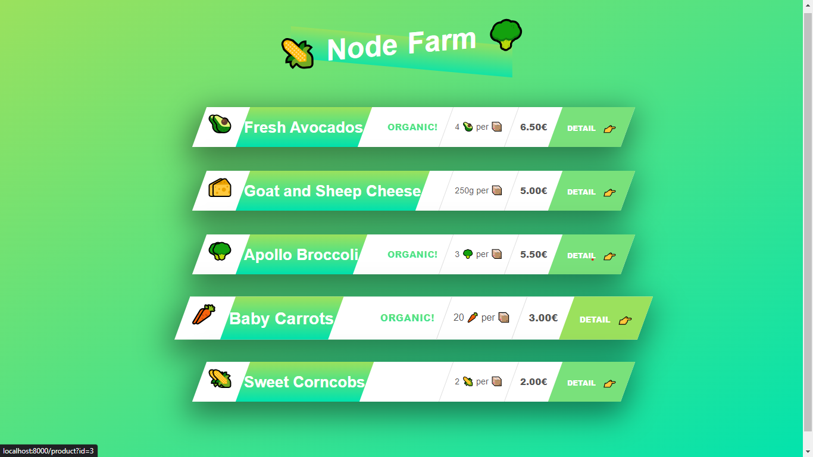
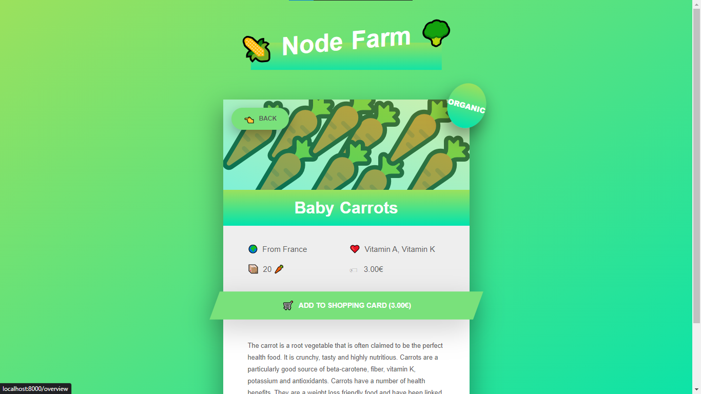

### Simple Project(NODE-FARM) to get started with node.js

> This is a `Hello World` project to learn node.js

### About NODE-FARM

> we have an html template and a json file. simple by using the data stored in the json file we fill the template and make it dynamic website(that has a backend logic).

### How to Use

> * Clone the project.

  * Open on you vs-code and open the terminal.

  * Then write ` node index.js ` on the terminal and hit _enter_

  * ```Listen to requests on port 8000 started!``` this will be displayed on the terminal 

  * Go to Your browser and write ` http://localhost:8000/ ` and hit _enter_

  -- HERE WE GO .... --

### Overview of the project

<p align='center'>
    
</p>

> When you click the `DETAILS` button, you will see ...

<p align='center'>
    
</p>


